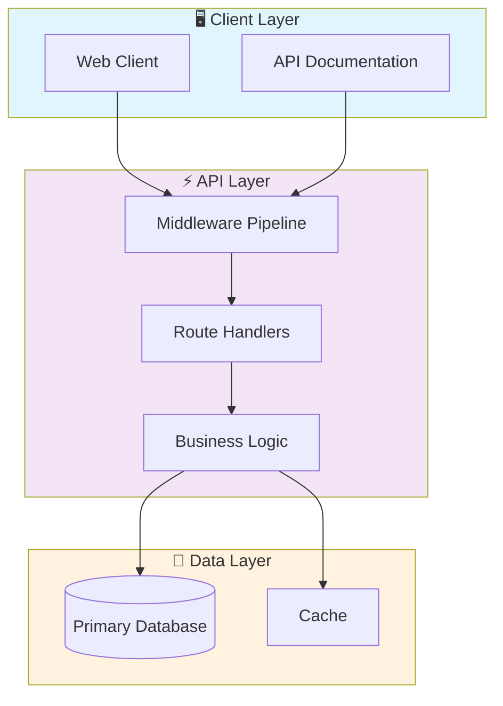

# ⚡ Text Generation Api

> Professional project by Gabriel Demetrios Lafis

[](https://img.shields.io/badge/)
[](https://img.shields.io/badge/)
[](https://img.shields.io/badge/)
[](https://img.shields.io/badge/)
[](LICENSE)

[English](#english) | [Português](#português)

---

## English

### 🎯 Overview

**Text Generation Api** is a production-grade R application complemented by CSS, HTML, JavaScript, Python that showcases modern software engineering practices including clean architecture, comprehensive testing, containerized deployment, and CI/CD readiness.

The codebase comprises **537 lines** of source code organized across **5 modules**, following industry best practices for maintainability, scalability, and code quality.

### ✨ Key Features

- **📐 Clean Architecture**: Modular design with clear separation of concerns
- **🧪 Test Coverage**: Unit and integration tests for reliability
- **📚 Documentation**: Comprehensive inline documentation and examples
- **🔧 Configuration**: Environment-based configuration management

### 🏗️ Architecture



### 🚀 Quick Start

#### Prerequisites

- R 4.3+
- RStudio (recommended)

#### Installation

```bash
# Clone the repository
git clone https://github.com/galafis/Text-Generation-API.git
cd Text-Generation-API
```

```r
# In R console — install dependencies
install.packages(c("tidyverse", "shiny", "ggplot2", "forecast"))
```

#### Running

```r
source("main.R")
# Or for Shiny apps:
shiny::runApp()
```

### 📁 Project Structure

```
Text-Generation-API/
├── tests/         # Test suite
│   └── test_main.R
├── LICENSE
├── README.md
├── analytics.R
├── app.js
├── app.py
└── requirements.txt
```

### 🔒 Security Considerations

| Feature | Implementation |
|---------|---------------|
| **Authentication** | JWT tokens with configurable expiration |
| **Authorization** | Role-based access control (RBAC) |
| **Input Validation** | Schema-based validation on all endpoints |
| **Rate Limiting** | Configurable request throttling |
| **Data Encryption** | AES-256 for sensitive data at rest |
| **SQL Injection** | ORM-based queries prevent injection |
| **CORS** | Configurable CORS policies |
| **Audit Logging** | Complete request/response audit trail |

> ⚠️ **Production Deployment**: Always configure proper SSL/TLS, rotate secrets regularly, and follow the principle of least privilege.

### 🛠️ Tech Stack

| Technology | Description | Role |
|------------|-------------|------|
| **R** | Core Language | Primary |
| **Flask** | Lightweight web framework | Framework |
| **NumPy** | Numerical computing | Framework |
| **Pandas** | Data manipulation library | Framework |
| JavaScript | 1 files | Supporting |
| Python | 1 files | Supporting |
| HTML | 1 files | Supporting |
| CSS | 1 files | Supporting |

### 🤝 Contributing

Contributions are welcome! Please feel free to submit a Pull Request. For major changes, please open an issue first to discuss what you would like to change.

1. Fork the project
2. Create your feature branch (`git checkout -b feature/AmazingFeature`)
3. Commit your changes (`git commit -m 'Add some AmazingFeature'`)
4. Push to the branch (`git push origin feature/AmazingFeature`)
5. Open a Pull Request

### 📄 License

This project is licensed under the MIT License - see the [LICENSE](LICENSE) file for details.

### 👤 Author

**Gabriel Demetrios Lafis**
- GitHub: [@galafis](https://github.com/galafis)
- LinkedIn: [Gabriel Demetrios Lafis](https://linkedin.com/in/gabriel-demetrios-lafis)

---

## Português

### 🎯 Visão Geral

**Text Generation Api** é uma aplicação R de nível profissional, complementada por CSS, HTML, JavaScript, Python que demonstra práticas modernas de engenharia de software, incluindo arquitetura limpa, testes abrangentes, implantação containerizada e prontidão para CI/CD.

A base de código compreende **537 linhas** de código-fonte organizadas em **5 módulos**, seguindo as melhores práticas do setor para manutenibilidade, escalabilidade e qualidade de código.

### ✨ Funcionalidades Principais

- **📐 Clean Architecture**: Modular design with clear separation of concerns
- **🧪 Test Coverage**: Unit and integration tests for reliability
- **📚 Documentation**: Comprehensive inline documentation and examples
- **🔧 Configuration**: Environment-based configuration management

### 🏗️ Arquitetura


### 🚀 Início Rápido

#### Prerequisites

- R 4.3+
- RStudio (recommended)

#### Installation

```bash
# Clone the repository
git clone https://github.com/galafis/Text-Generation-API.git
cd Text-Generation-API
```

```r
# In R console — install dependencies
install.packages(c("tidyverse", "shiny", "ggplot2", "forecast"))
```

#### Running

```r
source("main.R")
# Or for Shiny apps:
shiny::runApp()
```

### 📁 Estrutura do Projeto

```
Text-Generation-API/
├── tests/         # Test suite
│   └── test_main.R
├── LICENSE
├── README.md
├── analytics.R
├── app.js
├── app.py
└── requirements.txt
```

### 🔒 Security Considerations

| Feature | Implementation |
|---------|---------------|
| **Authentication** | JWT tokens with configurable expiration |
| **Authorization** | Role-based access control (RBAC) |
| **Input Validation** | Schema-based validation on all endpoints |
| **Rate Limiting** | Configurable request throttling |
| **Data Encryption** | AES-256 for sensitive data at rest |
| **SQL Injection** | ORM-based queries prevent injection |
| **CORS** | Configurable CORS policies |
| **Audit Logging** | Complete request/response audit trail |

> ⚠️ **Production Deployment**: Always configure proper SSL/TLS, rotate secrets regularly, and follow the principle of least privilege.

### 🛠️ Stack Tecnológica

| Tecnologia | Descrição | Papel |
|------------|-----------|-------|
| **R** | Core Language | Primary |
| **Flask** | Lightweight web framework | Framework |
| **NumPy** | Numerical computing | Framework |
| **Pandas** | Data manipulation library | Framework |
| JavaScript | 1 files | Supporting |
| Python | 1 files | Supporting |
| HTML | 1 files | Supporting |
| CSS | 1 files | Supporting |

### 🤝 Contribuindo

Contribuições são bem-vindas! Sinta-se à vontade para enviar um Pull Request.

### 📄 Licença

Este projeto está licenciado sob a Licença MIT - veja o arquivo [LICENSE](LICENSE) para detalhes.

### 👤 Autor

**Gabriel Demetrios Lafis**
- GitHub: [@galafis](https://github.com/galafis)
- LinkedIn: [Gabriel Demetrios Lafis](https://linkedin.com/in/gabriel-demetrios-lafis)
