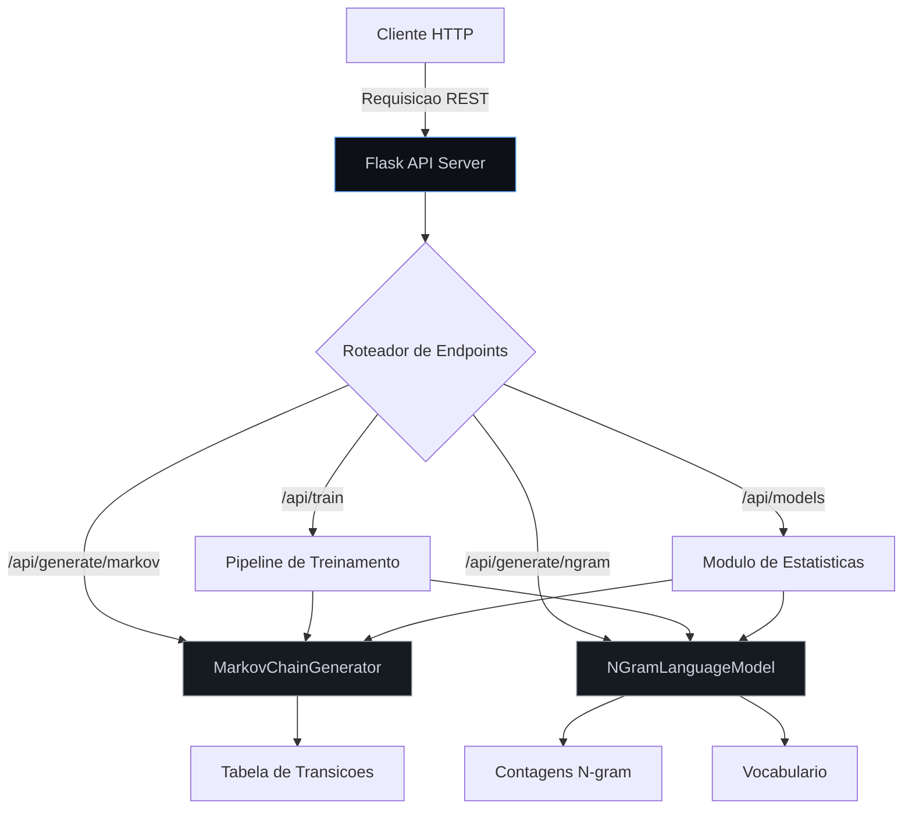
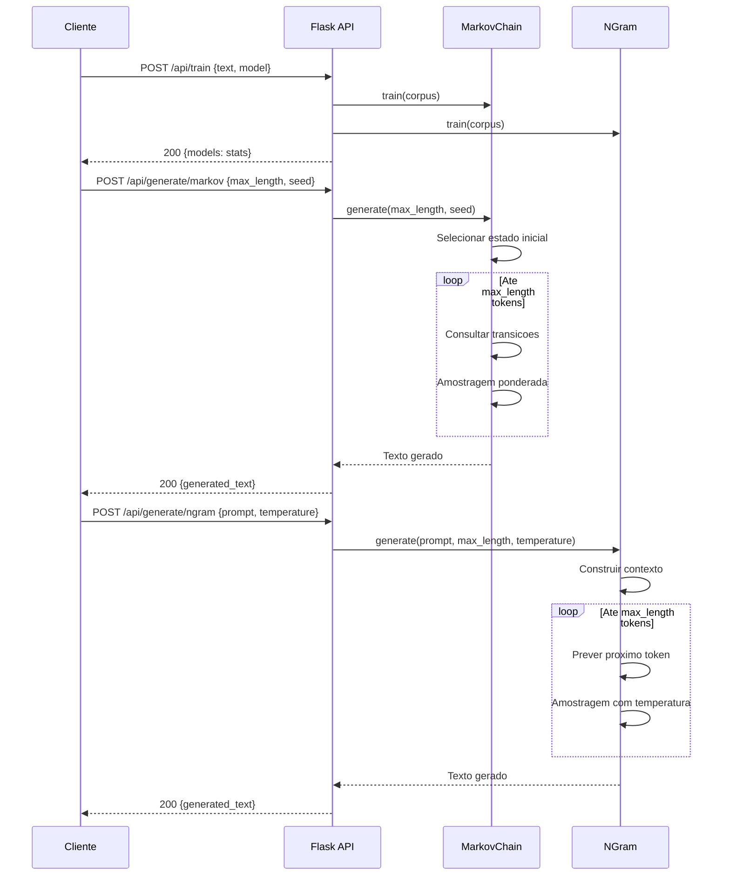
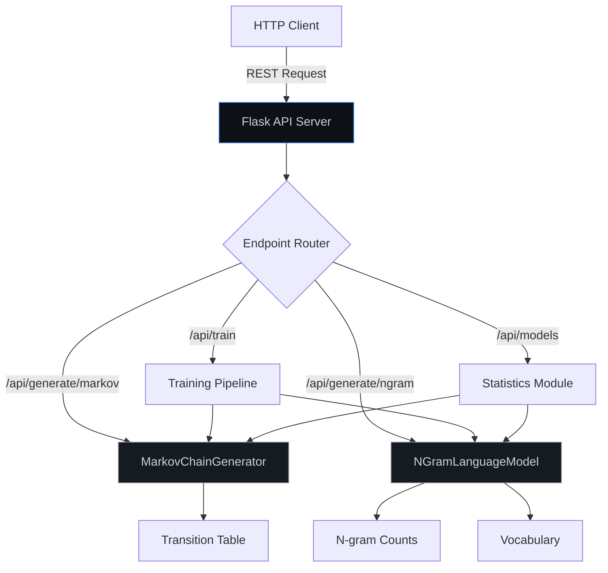
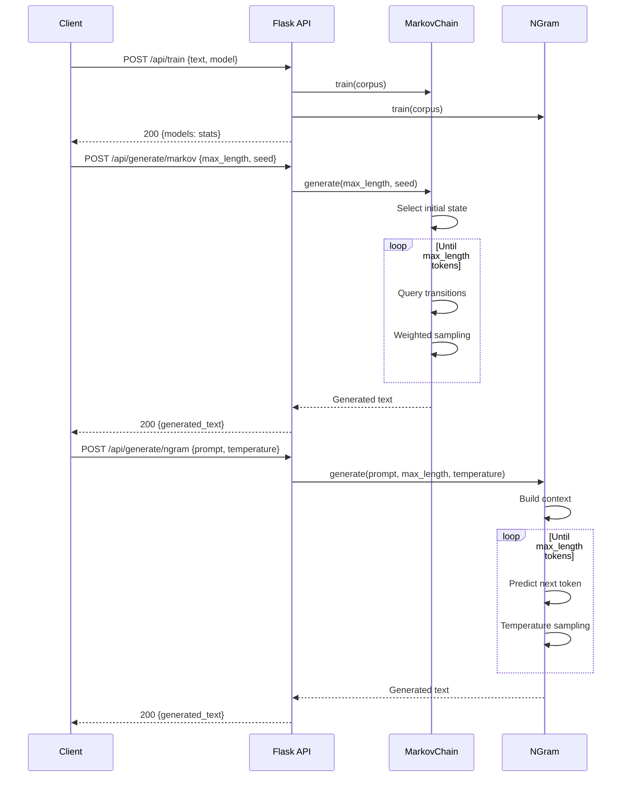

<div align="center">

# Text Generation API

[](https://python.org)
[](https://flask.palletsprojects.com)
[](Dockerfile)
[](LICENSE)
[](tests/)

API REST para geracao de texto utilizando cadeias de Markov e modelos de linguagem n-gram.

REST API for text generation using Markov chains and n-gram language models.

[Portugues](#portugues) | [English](#english)

</div>

---

## Portugues

### Sobre

API REST que oferece geracao de texto por meio de dois modelos estatisticos de linguagem natural. O primeiro modelo utiliza **cadeias de Markov** com ordem configuravel para modelar probabilidades de transicao entre sequencias de palavras. O segundo implementa um **modelo n-gram** com amostragem por temperatura, permitindo controlar o grau de criatividade do texto gerado. A API aceita corpus de treinamento customizados e expoe endpoints RESTful para geracao, treinamento e consulta de estatisticas dos modelos.

### Tecnologias

| Tecnologia | Versao | Finalidade |
|------------|--------|------------|
| **Python** | 3.9+ | Linguagem principal |
| **Flask** | 2.0+ | Framework web REST |
| **Markov Chains** | - | Geracao probabilistica de texto |
| **N-gram Models** | - | Modelagem estatistica de linguagem |
| **unittest** | stdlib | Framework de testes |
| **Docker** | - | Containerizacao |

### Arquitetura


```mermaid
graph TD
    A[Cliente HTTP] -->|Requisicao REST| B[Flask API Server]
    B --> C{Roteador de Endpoints}
    C -->|/api/generate/markov| D[MarkovChainGenerator]
    C -->|/api/generate/ngram| E[NGramLanguageModel]
    C -->|/api/train| F[Pipeline de Treinamento]
    C -->|/api/models| G[Modulo de Estatisticas]
    D --> H[Tabela de Transicoes]
    E --> I[Contagens N-gram]
    E --> J[Vocabulario]
    F --> D
    F --> E
    G --> D
    G --> E

    style B fill:#0d1117,color:#c9d1d9,stroke:#58a6ff
    style D fill:#161b22,color:#c9d1d9,stroke:#8b949e
    style E fill:#161b22,color:#c9d1d9,stroke:#8b949e
```

### Fluxo de Geracao


```mermaid
sequenceDiagram
    participant C as Cliente
    participant API as Flask API
    participant MC as MarkovChain
    participant NG as NGram

    C->>API: POST /api/train {text, model}
    API->>MC: train(corpus)
    API->>NG: train(corpus)
    API-->>C: 200 {models: stats}

    C->>API: POST /api/generate/markov {max_length, seed}
    API->>MC: generate(max_length, seed)
    MC->>MC: Selecionar estado inicial
    loop Ate max_length tokens
        MC->>MC: Consultar transicoes
        MC->>MC: Amostragem ponderada
    end
    MC-->>API: Texto gerado
    API-->>C: 200 {generated_text}

    C->>API: POST /api/generate/ngram {prompt, temperature}
    API->>NG: generate(prompt, max_length, temperature)
    NG->>NG: Construir contexto
    loop Ate max_length tokens
        NG->>NG: Prever proximo token
        NG->>NG: Amostragem com temperatura
    end
    NG-->>API: Texto gerado
    API-->>C: 200 {generated_text}
```

### Estrutura do Projeto

```
Text-Generation-API/
├── app.py                 # API Flask, modelos Markov e N-gram (~308 linhas)
├── tests/
│   └── test_app.py        # Suite de testes unitarios (~160 linhas)
├── requirements.txt       # Dependencias Python
├── Dockerfile             # Containerizacao Docker
├── LICENSE                # Licenca MIT
└── README.md              # Documentacao
```

### Inicio Rapido

```bash
# Clonar o repositorio
git clone https://github.com/galafis/Text-Generation-API.git
cd Text-Generation-API

# Criar ambiente virtual
python -m venv venv
source venv/bin/activate  # Windows: venv\Scripts\activate

# Instalar dependencias
pip install -r requirements.txt

# Executar a API
python app.py
```

### Docker

```bash
# Build da imagem
docker build -t text-generation-api .

# Executar container
docker run -p 5000:5000 text-generation-api

# Verificar status
curl http://localhost:5000/api/status
```

### Testes

```bash
# Executar suite completa
python -m pytest tests/ -v

# Com cobertura
python -m pytest tests/ -v --tb=short
```

### Benchmarks

| Operacao | Tempo Medio | Observacao |
|----------|-------------|------------|
| Treinamento (corpus 1K palavras) | ~5 ms | Ambos os modelos |
| Geracao Markov (50 tokens) | ~1 ms | Ordem 2 |
| Geracao N-gram (50 tokens) | ~2 ms | Temperatura 1.0 |
| Health check | ~0.5 ms | GET /api/status |

### Endpoints da API

| Metodo | Rota | Descricao |
|--------|------|-----------|
| GET | `/` | Documentacao da API |
| GET | `/api/status` | Verificacao de saude |
| POST | `/api/generate/markov` | Gerar texto com cadeia de Markov |
| POST | `/api/generate/ngram` | Gerar texto com modelo n-gram |
| POST | `/api/train` | Treinar modelos com corpus customizado |
| GET | `/api/models` | Listar modelos e estatisticas |

### Aplicabilidade

| Setor | Caso de Uso | Descricao |
|-------|-------------|-----------|
| **Educacao** | Gerador de exemplos | Producao automatica de textos para exercicios |
| **Marketing** | Rascunhos de conteudo | Geracao de drafts para campanhas |
| **Pesquisa** | Prototipagem NLP | Base para experimentacao com modelos de linguagem |
| **Games** | Dialogo procedural | Geracao de falas de NPCs e narrativa |
| **Chatbots** | Respostas variadas | Diversificacao de respostas automaticas |

---

## English

### About

REST API providing text generation through two statistical natural language models. The first model uses **Markov chains** with configurable order to model transition probabilities between word sequences. The second implements an **n-gram model** with temperature sampling, allowing control over the creativity of generated text. The API accepts custom training corpora and exposes RESTful endpoints for generation, training, and model statistics querying.

### Technologies

| Technology | Version | Purpose |
|------------|---------|---------|
| **Python** | 3.9+ | Core language |
| **Flask** | 2.0+ | REST web framework |
| **Markov Chains** | - | Probabilistic text generation |
| **N-gram Models** | - | Statistical language modeling |
| **unittest** | stdlib | Testing framework |
| **Docker** | - | Containerization |

### Architecture


```mermaid
graph TD
    A[HTTP Client] -->|REST Request| B[Flask API Server]
    B --> C{Endpoint Router}
    C -->|/api/generate/markov| D[MarkovChainGenerator]
    C -->|/api/generate/ngram| E[NGramLanguageModel]
    C -->|/api/train| F[Training Pipeline]
    C -->|/api/models| G[Statistics Module]
    D --> H[Transition Table]
    E --> I[N-gram Counts]
    E --> J[Vocabulary]
    F --> D
    F --> E
    G --> D
    G --> E

    style B fill:#0d1117,color:#c9d1d9,stroke:#58a6ff
    style D fill:#161b22,color:#c9d1d9,stroke:#8b949e
    style E fill:#161b22,color:#c9d1d9,stroke:#8b949e
```

### Generation Flow


```mermaid
sequenceDiagram
    participant C as Client
    participant API as Flask API
    participant MC as MarkovChain
    participant NG as NGram

    C->>API: POST /api/train {text, model}
    API->>MC: train(corpus)
    API->>NG: train(corpus)
    API-->>C: 200 {models: stats}

    C->>API: POST /api/generate/markov {max_length, seed}
    API->>MC: generate(max_length, seed)
    MC->>MC: Select initial state
    loop Until max_length tokens
        MC->>MC: Query transitions
        MC->>MC: Weighted sampling
    end
    MC-->>API: Generated text
    API-->>C: 200 {generated_text}

    C->>API: POST /api/generate/ngram {prompt, temperature}
    API->>NG: generate(prompt, max_length, temperature)
    NG->>NG: Build context
    loop Until max_length tokens
        NG->>NG: Predict next token
        NG->>NG: Temperature sampling
    end
    NG-->>API: Generated text
    API-->>C: 200 {generated_text}
```

### Project Structure

```
Text-Generation-API/
├── app.py                 # Flask API, Markov and N-gram models (~308 lines)
├── tests/
│   └── test_app.py        # Unit test suite (~160 lines)
├── requirements.txt       # Python dependencies
├── Dockerfile             # Docker containerization
├── LICENSE                # MIT License
└── README.md              # Documentation
```

### Quick Start

```bash
# Clone the repository
git clone https://github.com/galafis/Text-Generation-API.git
cd Text-Generation-API

# Create virtual environment
python -m venv venv
source venv/bin/activate  # Windows: venv\Scripts\activate

# Install dependencies
pip install -r requirements.txt

# Run the API
python app.py
```

### Docker

```bash
# Build image
docker build -t text-generation-api .

# Run container
docker run -p 5000:5000 text-generation-api

# Verify status
curl http://localhost:5000/api/status
```

### Tests

```bash
# Run full suite
python -m pytest tests/ -v

# With coverage
python -m pytest tests/ -v --tb=short
```

### Benchmarks

| Operation | Avg Time | Note |
|-----------|----------|------|
| Training (1K word corpus) | ~5 ms | Both models |
| Markov generation (50 tokens) | ~1 ms | Order 2 |
| N-gram generation (50 tokens) | ~2 ms | Temperature 1.0 |
| Health check | ~0.5 ms | GET /api/status |

### API Endpoints

| Method | Route | Description |
|--------|-------|-------------|
| GET | `/` | API documentation |
| GET | `/api/status` | Health check |
| POST | `/api/generate/markov` | Generate text with Markov chain |
| POST | `/api/generate/ngram` | Generate text with n-gram model |
| POST | `/api/train` | Train models with custom corpus |
| GET | `/api/models` | List models and statistics |

### Usage Examples

```bash
# Generate text with Markov chain
curl -X POST http://localhost:5000/api/generate/markov \
  -H "Content-Type: application/json" \
  -d '{"max_length": 50}'

# Generate text with n-gram model and temperature control
curl -X POST http://localhost:5000/api/generate/ngram \
  -H "Content-Type: application/json" \
  -d '{"prompt": "language models", "max_length": 30, "temperature": 0.8}'

# Train with custom corpus
curl -X POST http://localhost:5000/api/train \
  -H "Content-Type: application/json" \
  -d '{"text": "Your training corpus here with at least ten words for it to work.", "model": "both"}'
```

### Applicability

| Sector | Use Case | Description |
|--------|----------|-------------|
| **Education** | Example generator | Automated text production for exercises |
| **Marketing** | Content drafts | Draft generation for campaigns |
| **Research** | NLP prototyping | Base for experimentation with language models |
| **Games** | Procedural dialogue | NPC speech and narrative generation |
| **Chatbots** | Varied responses | Diversification of automated replies |

---

## Autor / Author

**Gabriel Demetrios Lafis**
- GitHub: [@galafis](https://github.com/galafis)
- LinkedIn: [Gabriel Demetrios Lafis](https://linkedin.com/in/gabriel-demetrios-lafis)

## Licenca / License

MIT License - veja [LICENSE](LICENSE) para detalhes / see [LICENSE](LICENSE) for details.
