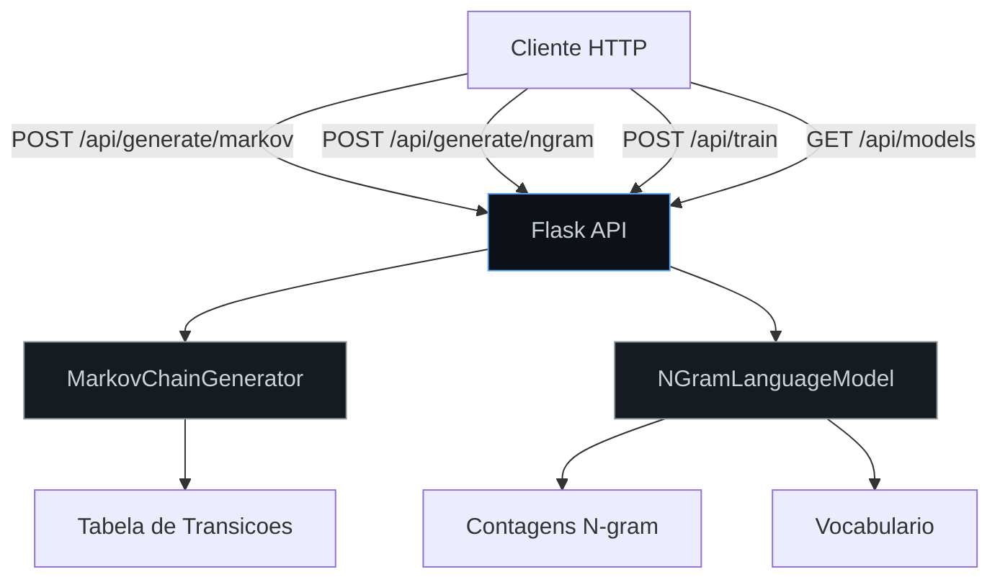
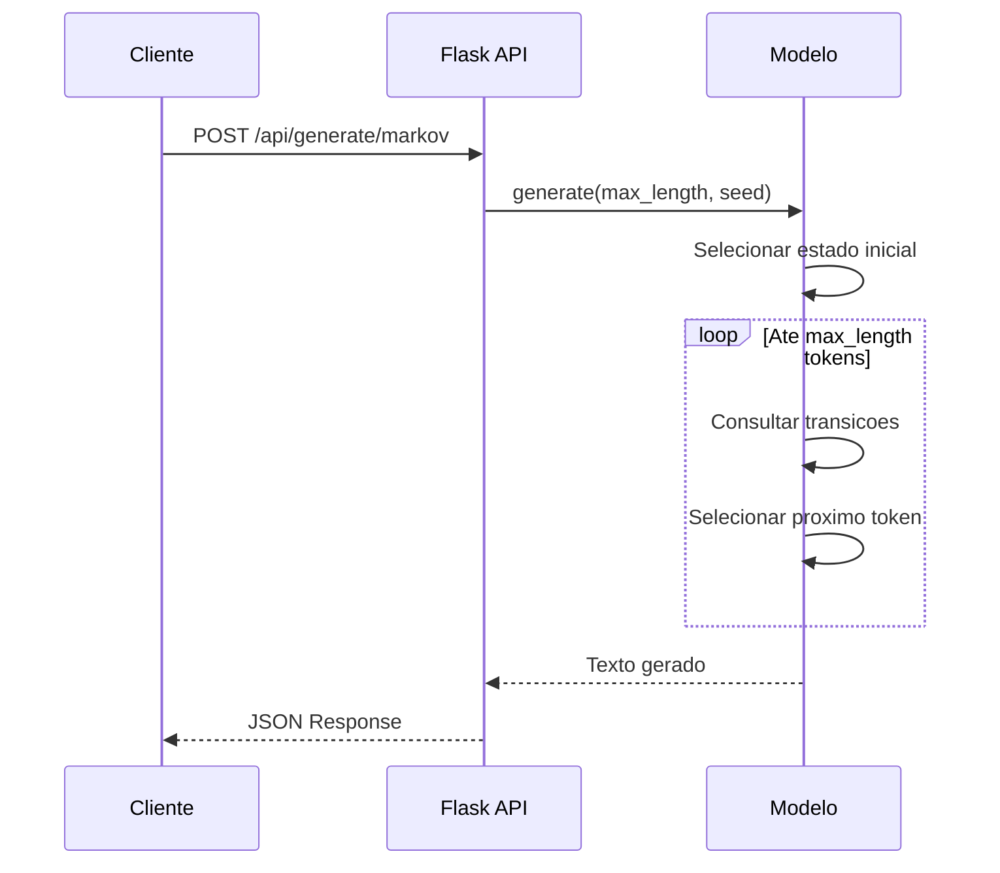
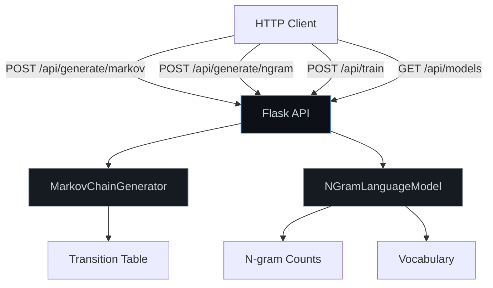

# Text Generation API

API REST para geracao de texto utilizando cadeias de Markov e modelos de linguagem n-gram.

REST API for text generation using Markov chains and n-gram language models.

[](https://python.org)
[](https://flask.palletsprojects.com)
[](LICENSE)

[Portugues](#portugues) | [English](#english)

---

## Portugues

### Visao Geral

API REST que oferece geracao de texto atraves de dois modelos estatisticos de linguagem:

- **Cadeia de Markov**: Gera texto modelando probabilidades de transicao entre sequencias de palavras (n-gramas configuraveis).
- **Modelo N-gram**: Modelo de linguagem com amostragem por temperatura, permitindo controlar a criatividade do texto gerado.

A API aceita corpus de treinamento customizados e expoe endpoints para geracao, treinamento e consulta de estatisticas dos modelos.

### Arquitetura


```mermaid
graph TD
    A[Cliente HTTP] -->|POST /api/generate/markov| B[Flask API]
    A -->|POST /api/generate/ngram| B
    A -->|POST /api/train| B
    A -->|GET /api/models| B
    B --> C[MarkovChainGenerator]
    B --> D[NGramLanguageModel]
    C --> E[Tabela de Transicoes]
    D --> F[Contagens N-gram]
    D --> G[Vocabulario]

    style B fill:#0d1117,color:#c9d1d9,stroke:#58a6ff
    style C fill:#161b22,color:#c9d1d9,stroke:#8b949e
    style D fill:#161b22,color:#c9d1d9,stroke:#8b949e
```

### Pipeline de Geracao


```mermaid
sequenceDiagram
    participant C as Cliente
    participant API as Flask API
    participant M as Modelo

    C->>API: POST /api/generate/markov
    API->>M: generate(max_length, seed)
    M->>M: Selecionar estado inicial
    loop Ate max_length tokens
        M->>M: Consultar transicoes
        M->>M: Selecionar proximo token
    end
    M-->>API: Texto gerado
    API-->>C: JSON Response
```

### Inicio Rapido

```bash
# Clonar o repositorio
git clone https://github.com/galafis/Text-Generation-API.git
cd Text-Generation-API

# Instalar dependencias
pip install -r requirements.txt

# Executar a API
python app.py
```

### Exemplos de Uso

```bash
# Gerar texto com cadeia de Markov
curl -X POST http://localhost:5000/api/generate/markov \
  -H "Content-Type: application/json" \
  -d '{"max_length": 50}'

# Gerar texto com modelo n-gram e temperatura
curl -X POST http://localhost:5000/api/generate/ngram \
  -H "Content-Type: application/json" \
  -d '{"prompt": "language models", "max_length": 30, "temperature": 0.8}'

# Treinar com corpus customizado
curl -X POST http://localhost:5000/api/train \
  -H "Content-Type: application/json" \
  -d '{"text": "Seu corpus de treinamento aqui com pelo menos dez palavras para funcionar.", "model": "both"}'
```

### Endpoints

| Metodo | Rota | Descricao |
|--------|------|-----------|
| GET | `/` | Documentacao da API |
| GET | `/api/status` | Verificacao de saude do servico |
| POST | `/api/generate/markov` | Gerar texto com cadeia de Markov |
| POST | `/api/generate/ngram` | Gerar texto com modelo n-gram |
| POST | `/api/train` | Treinar modelos com texto customizado |
| GET | `/api/models` | Listar modelos e estatisticas |

### Estrutura do Projeto

```
Text-Generation-API/
├── app.py              # API Flask e modelos de geracao
├── tests/
│   └── test_app.py     # Suite de testes
├── requirements.txt    # Dependencias Python
├── LICENSE
└── README.md
```

### Testes

```bash
python -m pytest tests/ -v
```

---

## English

### Overview

REST API providing text generation through two statistical language models:

- **Markov Chain**: Generates text by modeling transition probabilities between word sequences (configurable n-grams).
- **N-gram Model**: Language model with temperature sampling, allowing control over the creativity of generated text.

The API accepts custom training corpora and exposes endpoints for generation, training, and model statistics.

### Architecture


```mermaid
graph TD
    A[HTTP Client] -->|POST /api/generate/markov| B[Flask API]
    A -->|POST /api/generate/ngram| B
    A -->|POST /api/train| B
    A -->|GET /api/models| B
    B --> C[MarkovChainGenerator]
    B --> D[NGramLanguageModel]
    C --> E[Transition Table]
    D --> F[N-gram Counts]
    D --> G[Vocabulary]

    style B fill:#0d1117,color:#c9d1d9,stroke:#58a6ff
    style C fill:#161b22,color:#c9d1d9,stroke:#8b949e
    style D fill:#161b22,color:#c9d1d9,stroke:#8b949e
```

### Quick Start

```bash
# Clone the repository
git clone https://github.com/galafis/Text-Generation-API.git
cd Text-Generation-API

# Install dependencies
pip install -r requirements.txt

# Run the API
python app.py
```

### Usage Examples

```bash
# Generate text with Markov chain
curl -X POST http://localhost:5000/api/generate/markov \
  -H "Content-Type: application/json" \
  -d '{"max_length": 50}'

# Generate text with n-gram model and temperature
curl -X POST http://localhost:5000/api/generate/ngram \
  -H "Content-Type: application/json" \
  -d '{"prompt": "language models", "max_length": 30, "temperature": 0.8}'

# Train with custom corpus
curl -X POST http://localhost:5000/api/train \
  -H "Content-Type: application/json" \
  -d '{"text": "Your training corpus here with at least ten words for it to work.", "model": "both"}'
```

### Endpoints

| Method | Route | Description |
|--------|-------|-------------|
| GET | `/` | API documentation |
| GET | `/api/status` | Service health check |
| POST | `/api/generate/markov` | Generate text with Markov chain |
| POST | `/api/generate/ngram` | Generate text with n-gram model |
| POST | `/api/train` | Train models with custom text |
| GET | `/api/models` | List models and statistics |

### Project Structure

```
Text-Generation-API/
├── app.py              # Flask API and generation models
├── tests/
│   └── test_app.py     # Test suite
├── requirements.txt    # Python dependencies
├── LICENSE
└── README.md
```

### Tests

```bash
python -m pytest tests/ -v
```

---

## Tecnologias / Technologies

- **Python 3.9+**
- **Flask** - Web framework
- **Markov Chains** - Probabilistic text generation
- **N-gram Models** - Statistical language modeling

## Autor / Author

**Gabriel Demetrios Lafis**
- GitHub: [@galafis](https://github.com/galafis)
- LinkedIn: [Gabriel Demetrios Lafis](https://linkedin.com/in/gabriel-demetrios-lafis)

## Licenca / License

MIT License - veja [LICENSE](LICENSE) para detalhes / see [LICENSE](LICENSE) for details.
